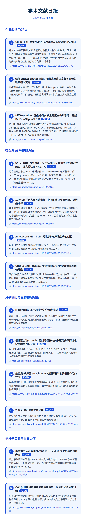
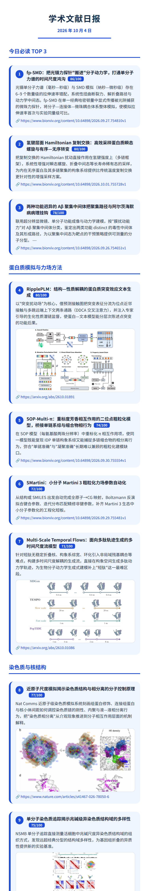

# academic-daily-digest

Hermes Agent skill：面向生物物理/蛋白质力学/结构生物学方向的**学术文献日报**，自动采集 → 打分 → 生成手机卡片版 PDF，推送到微信等消息平台。

每天一封 ~3 页的图文卡片 PDF，含 arXiv/bioRxiv/Nature/Cell/Science/PNAS 等 20+ 信源，自动抓取论文主图、可点击跳转原文。

 

## 📰 输出效果（手机 PDF 实拍）

下面两张就是**手机上收到的 PDF 卡片版式的真实渲染截图**（100mm 手机宽度、深蓝学术主题、圆形序号徽章 + 分数胶囊徽章、卡片圆角、🔗 可点击原文链接），不是文字模拟——装好后你微信里收到的就是这个样子：

<table>
<tr>
<td width="50%" align="center">
  <b>2026-10-05 期</b>（16 条收录）<br/>
  <a href="assets/preview-1005.png"></a><br/>
  <sub>TOP3：GuideFlip 蛋白结合剂设计 / sticker-spacer 致病变异语法 / DiffEnsemble 构象系综扩散</sub>
</td>
<td width="50%" align="center">
  <b>2026-10-04 期</b>（17 条收录）<br/>
  <a href="assets/preview-1004.png"></a><br/>
  <sub>TOP3：fp-SMD 光镊力谱模拟 / 氢键 Hamiltonian 复制交换 / Aβ 聚集中间体分型</sub>
</td>
</tr>
</table>

> 截图为 2× 分辨率渲染（与手机 Retina 屏一致），点击可放大查看原始尺寸。以下折叠块是同一内容的**文字版**，便于搜索与复制链接：

<details open>
<summary><b>2026-10-05 期</b>（文字版）— 点击展开/收起</summary>

> 领域：生物物理 / 蛋白质力学 / 结构生物学与计算结构生物学

**今日必读 TOP 3**

### 1. GuideFlip：为柔性/内在无序靶点从头设计蛋白结合剂 [84/100]
针对 IDP 等柔性靶点"结合前不存在稳定结构"的从头设计困境，提出先固定相互作用再翻转侧链的策略：以序列先验引导骨架-相互作用联合生成，绕开"先生成结构再设计结合剂"的两步范式，在 IDP 与多构象靶点上验证了结合剂设计成功率。
🔗 https://www.biorxiv.org/content/10.64898/2026.09.27.754145v1
来源：bioRxiv biophysics｜标签：蛋白质设计, IDP, 从头结合剂

### 2. 精修 sticker-spacer 语法：相分离无序区富集可解释的致病错义变异 [80/100]
系统刻画相分离 IDR（PS-IDR）的 sticker-spacer 组织，发现 PS-IDR 致病错义突变率约为普通 IDR 的三倍；给出标记高致病风险无序区的可解释序列规则。
🔗 https://www.biorxiv.org/content/10.64898/2026.09.25.754449v1
来源：bioRxiv biophysics｜标签：相分离, IDR, 错义变异

### 3. DiffEnsemble：进化条件扩散重建蛋白构象系综，超越 BioEmu/AlphaFLOW [78/100]
从 PDB 静态结构学习潜在动力学表征，扩散过程中以 AlphaFold DB 结构截面作为条件引导；ATLAS 72 个靶点上系综 RMSD/RMSF 相关性较 AlphaFLOW 分别提升 28.9% 与 7.5%。
🔗 https://pubmed.ncbi.nlm.nih.gov/42734541/
来源：J. Chem. Inf. Model.（PubMed 补采）｜标签：构象系综, 扩散模型, AlphaFold

其余小节：蛋白质 AI 与模拟方法（SA-MPNN、增强采样可解释性、AmyloCore-ML、UltraSelect）/ 分子模拟与生物物理理论（MesoMem、LLPS 拥挤机制、染色质-核纤层、β-桶计数）/ 单分子实验与蛋白力学（磁镊 VWF、心肌 β-肌球蛋白突变、Tau 序列反转、Gβγ-PLCβ3）/ 染色质与核结构方法（Nat Methods 空间分辨染色质构象）。

</details>

<details>
<summary><b>2026-10-04 期</b>（文字版）— 点击展开/收起</summary>

> 领域：生物物理 / 蛋白质力学 / 结构生物学与计算结构生物学

**今日必读 TOP 3**

### 1. fp-SMD：把光镊力探针"搬进"分子动力学，打通单分子力谱的时间尺度鸿沟 [86/100]
光镊单分子力谱（毫秒—秒级）与 SMD 模拟（纳秒—微秒级）存在 6–9 个数量级的拉伸速率错配。fp-SMD 在单一经典哈密顿量中显式传播被光阱捕获的微珠力探针，使模拟拉伸速率首次与实验同量级可比。
🔗 https://www.biorxiv.org/content/10.64898/2026.09.27.754810v1
来源：bioRxiv biophysics｜标签：单分子力谱, 加权 steered MD, 光镊

### 2. 氢键层面 Hamiltonian 复制交换：高效采样蛋白质瞬态螺旋与有序—无序转变 [80/100]
把复制交换的 Hamiltonian 扰动直接作用在氢键强度上（多链框架），系统性增强对瞬态螺旋、折叠中间态等长寿命稀有态的采样。
🔗 https://www.biorxiv.org/content/10.64898/2026.10.01.755728v1
来源：bioRxiv biophysics｜标签：增强采样, 内在无序蛋白, 构象系综

### 3. 两种功能迥异的 Aβ 聚集中间体把聚集路径与阿尔茨海默病病理挂钩 [78/100]
联用超分辨显微镜、单分子功能成像与动力学建模，按"膜扰动能力"对 Aβ 聚集中间体分类，为以聚集中间态为靶点的干预策略提供可测量的分子分型。
🔗 https://www.biorxiv.org/content/10.64898/2026.09.26.754651v1
来源：bioRxiv biophysics｜标签：淀粉样蛋白, 单分子成像, 病理机制

其余小节：蛋白质模拟与力场方法（RipplePLM、SOP-Multi-π、SMartini、多肽轨迹生成流）/ 染色质与核结构（Nat Comms 近原子尺度染色质模拟、NSMB 单分子染色质追踪、活性核小体重塑、SAXS 癌细胞核）/ 计算结构生物学与蛋白科学（ROBUST 耐药、AuditPPI、EnsPlex、病毒四级结构普查、共翻译折叠、NS1 动力学网络）。

</details>

## 一键安装（Hermes Agent）

```bash
hermes skills install Cosmoto-jian/academic-daily-digest/academic-daily-digest
```

或在 Hermes 会话里直接说：

```
/skills install Cosmoto-jian/academic-daily-digest/academic-daily-digest
```

✅ 已实测：Hermes 自动定位 GitHub 仓库、完成安全扫描（SAFE），把 `SKILL.md` + `references/` + `scripts/` 全部装入 `~/.hermes/skills/`，装完即可用 `/academic-daily-digest` 调用。

手动安装（其他 agent 也适用）：把 `academic-daily-digest/` 整个目录复制到你的 skills 目录即可。

## 使用

安装后对 Hermes 说：

- 「帮我配置每天下午 5 点的学术文献日报」（agent 会创建 cron 任务）
- 或 `/academic-daily-digest 生成今天的文献日报`

## 🔧 如何配置 RSS 源（改成你自己的领域）

所有信源都定义在 skill 的 `SKILL.md` → **「第一步：采集」** 一节里，就是一份「信源名 → RSS/Atom XML 地址」的清单。改这一处即可换领域，**不需要动任何脚本代码**。

### 1️⃣ 信源清单在哪里改

打开 `academic-daily-digest/SKILL.md`，找到：

```markdown
**直接抓 RSS（实测 200 可用）：**
- 1-Core 期刊：BiophysJ `cell.com/biophysj/current.rss`、JMPS `...`、...
- 2-Methods：`nature.com/{natmachintell|...}.rss`、...
- 3-Broad（须过关键词过滤）：`feeds.aps.org/rss/recent/{prl|prx|pre}.xml`、...
```

把它换成你的目标期刊 RSS 即可。常见出版商的 RSS 地址规律：

| 出版商 | RSS 地址模板 | 例子 |
|---|---|---|
| Cell Press | `https://www.cell.com/{期刊名}/current.rss` | `cell.com/biophysj/current.rss` |
| Nature 系列 | `https://www.nature.com/{期刊缩写}.rss` | `nature.com/nsmb.rss`、`nature.com/ncomms.rss` |
| ScienceDirect (Elsevier) | `https://rss.sciencedirect.com/publication/science/{ISSN数字}` | JMB=`00222836`、JMPS=`00225096` |
| APS (PRL/PRX/PRE) | `https://feeds.aps.org/rss/recent/{期刊}.xml` | `feeds.aps.org/rss/recent/prl.xml` |
| PLOS | `https://journals.plos.org/{期刊}/feed/atom` | `ploscompbiol/feed/atom` |
| eLife | `https://elifesciences.org/rss/recent.xml` | — |
| arXiv 分类流 | `https://rss.arxiv.org/atom/{分类}` | `q-bio.BM`、`physics.bio-ph`、`cond-mat.soft` |
| bioRxiv 分类 | `https://connect.biorxiv.org/biorxiv_xml.php?subject={分类}` | `biophysics`、`bioinformatics` |
| ACS / OUP（有反爬） | 走 PubMed eutils 替代：`eutils.ncbi.nlm.nih.gov/entrez/eutils/esearch.fcgi?db=pubmed&term=<期刊[jour]+AND+关键词[tiab]>&retmax=20&sort=date` | JCTC、JCIM、NSR |

> 💡 找一本期刊的 RSS：打开期刊首页，页头/页脚找 RSS 图标（橙色 📡）；Cell/Nature/Wiley/APS/PLOS 都遵循上表规律。

### 2️⃣ 关键词过滤在哪里改

`academic-daily-digest/references/filters.md` 里定义了四类词表，全部是**标题 contains、不区分大小写**的简单匹配：

- **3-Broad 综合刊过滤** — 宽泛词表（protein、membrane、molecular dynamics…），用于过滤 PRL/PRE/eLife 这类综合刊
- **arXiv A（蛋白 AI）** — protein language model、ESM-2、AlphaFold、variant effect…
- **arXiv B（蛋白力学/构象动力学）** — ion channel、allosteric、coarse-grained、conformational ensemble…
- **bioRxiv 过滤** — 上面两表的并集
- **PubMed 替代检索式** — JCTC/JCIM/NSR 等反爬期刊的 PubMed 查询语句

换成你自己的领域，把词表内容替换即可。例如做气候科学就换成 `climate`、`atmosphere`、`ENSO`…；做免疫学就换成 `T cell`、`antibody`、`cytokine`…

### 3️⃣ 跨天去重（自动，无需配置）

skill 会自动读取存档目录（默认 `~/briefings/`）里最近 3 期日报的标题和链接，同一论文（同 DOI / arXiv ID / 同标题）不重复收录，避免连续几天推送重复内容。

### 4️⃣ 快速自检

改完 RSS 后跑一次就能验证：

```
/academic-daily-digest 试跑一次，看采集是否成功
```

成功的标志：
- 每条日报的 🔗 链接能点开
- `采集与失效说明` 一节列出的失败信源为空，或能解释（如该期刊本期无新文章、arXiv 限流降级）

## 依赖

- Python 3.10+（仅标准库）
- PDF 渲染二选一：
  - **Chromium**（推荐）— playwright 的 headless shell 或系统 chrome，自动探测，或 `CHROME=` 指定
  - **XeLaTeX**（备用 A4 版）— `texlive-xetex fonts-noto-cjk`
- 无需 API key（全部公开 RSS / PubMed eutils / arXiv API）

## 定制你的领域

关键词过滤词表在 `academic-daily-digest/references/filters.md`，信源清单在 `SKILL.md` 的「第一步：采集」。改成你自己的研究方向只需要改这两处。

## 结构

```
academic-daily-digest/
├── SKILL.md                      # 主流程（采集→打分→PDF→投递）
├── references/
│   ├── filters.md                # 领域关键词过滤词表
│   └── report-format.md          # 成文/PDF 图文格式规则
└── scripts/
    ├── digest_to_mobile_pdf.py   # Markdown → 手机卡片版 PDF（Chromium）
    ├── academic_md_to_tex.py     # Markdown → A4 LaTeX PDF（XeLaTeX）
    └── fetch_hero_images.py      # 自动抓取论文主图（arXiv teaser/og:image）
```

## License

MIT © Jian Wang
